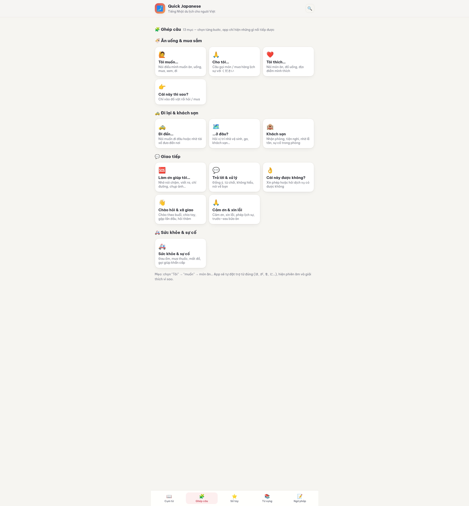

# Quick Japanese 🗾

**Ghép câu tiếng Nhật cho người Việt đi du lịch.** Chọn nghĩa theo từng bước, app ráp câu tiếng
Nhật đúng trợ từ, kèm phiên âm tiếng Việt, trọng âm và bóc tách câu; **nghe & đáp câu nhân viên
nói trước**; tra thêm 747 từ vựng (561 từ JLPT N5, có câu ví dụ và pitch accent).

🌐 **Dùng thử: <https://teefan.github.io/quick-japanese/>** · 📲 Cài như app (PWA) và dùng offline.

- 🧩 **Ghép câu thu hẹp dần** (16 mục, gom theo nhóm: Giao tiếp cơ bản · Ăn uống, mua sắm & thanh
  toán · Đi lại & khách sạn · Sự cố & sức khỏe): bấm **⚡ Chọn nhanh** hoặc chọn “Không cần chủ
  ngữ” → “muốn” → món…
  Câu tiếng Nhật tự ráp đúng trợ từ (は, が, を, に…), kèm furigana và phiên âm ngay trên từng trợ từ.
  Bao gồm chào hỏi, **cảm ơn (kể cả mẫu 〜てくれてありがとう “cảm ơn vì đã…”)**, xin lỗi,
  trả lời/không hiểu, khách sạn, **thanh toán – hoá đơn – miễn thuế**, **bị lạc đường**,
  đau ốm – mất đồ – gọi giúp khẩn cấp.
- 🔬 **Bóc tách câu**: câu ghép được chia thành các mảnh (từ + trợ từ) **tô màu theo vai trò
  ngữ pháp** (đại từ, danh từ, động từ, tính từ, trợ từ, です, số đếm…), kèm phiên âm Việt + romaji,
  nghĩa và loại từ/thể. Bộ tách từ nằm ở `tools/segment.js`.
- 🇻🇳 **Phiên âm tiếng Việt** trên mọi từ và câu (kiểu `xư-mi-ma-xen`, `côn-ni-chi-oa`) — kèm
  **romaji chính thức** (Hepburn) song song: `sumimasen`, `konnichiwa`.
- 📚 **747 từ vựng** (186 từ du lịch biên tập tay + 561 từ JLPT N5 tải nền theo nhu cầu) —
  **460 từ N5 kèm câu ví dụ** lấy từ Tatoeba (phiên âm Việt + romaji + nghĩa tiếng Việt);
  **trọng âm (pitch accent) cho 726 từ** — kana với mora cao có gạch trên, dấu ↓ xuống giọng
  và số `[n]`; kèm lượng từ đếm 1–10 và mệnh giá tiền.
- 🔗 **Hai tab liên kết với nhau**: mỗi thẻ từ vựng có chip “🧩 Ghép câu” mở thẳng mục ghép câu
  dùng từ đó (bưu điện → …ở đâu?, 水 → Cho tôi… / Tôi muốn…).
- 🗣️ **Nghe & đáp**: tình huống **nhân viên nói trước** (nhà hàng, cửa hàng, khách sạn) — câu họ nói
  kèm furigana, phiên âm, 🔊 và gợi ý câu đáp; câu ghép xong cũng hiện “Người Nhật có thể nói”.
- 🔊 Đọc tiếng Nhật bằng giọng máy (Web Speech API) trên từ, câu ví dụ và câu ghép.
- 🌗 **Nền sáng mặc định** (giấy washi + sakura, không theo hệ điều hành); bấm 🌙 trên header
  để đổi nền tối — lựa chọn được ghi nhớ.
- 📶 **PWA offline**: service worker cache toàn bộ app — không cần mạng khi đã mở một lần.
- 📴 Không cần server, không cần build khi dùng, chạy được cả khi mở trực tiếp `index.html`.



## Dùng ngay

```bash
# Cách 1: mở thẳng file
xdg-open index.html        # macOS: open index.html

# Cách 2: chạy server tĩnh (khuyến nghị, để test đầy đủ)
npm run serve              # http://localhost:8080
```

## Cấu trúc

```
index.html                 trang chính (load data + app)
manifest.webmanifest       khai báo PWA (cài như app)
sw.js                      service worker — cache offline
assets/css/style.css       giao diện, mobile-first, có dark mode
assets/js/app.js           2 tab: Ghép câu, Từ vựng + TTS + PWA
assets/js/assemble.js      logic ráp câu thuần (builder + audit dùng chung)
assets/js/builder.js       engine ghép câu (cây ý định thu hẹp dần)
assets/icons/              icon PWA (SVG gốc + PNG 192/512)
data/source/*.json         dữ liệu gốc để biên tập (từ vựng, vocab-n5, câu ví dụ N5, trọng âm, cây câu, nghe–đáp, số đếm)
data/*.js                  dữ liệu đã sinh — window.QJ.* (đừng sửa tay); vocab-n5.js tải theo nhu cầu,
                           builder-index.js nối từ vựng với mục ghép câu, exchanges.js cho mục Nghe & đáp
tools/kana.js              kana → romaji / phiên âm Việt / chia động từ
tools/segment.js           bóc tách câu: từ điển + tokenizer DP
tools/build.js             kiểm tra + làm giàu dữ liệu, xuất data/*.js
tools/audit.js             soát toàn bộ đường ghép câu + nhất quán cây (chạy trong npm run build)
docs/PLAN.md               kế hoạch tổng thể, thiết kế dữ liệu, lộ trình
docs/DEV-CONTEXT.md        bối cảnh & hướng dẫn cho phiên phát triển mới (đọc trước khi code)
docs/PRONUNCIATION.md      quy ước phiên âm tiếng Việt
```

## Thêm nội dung

1. Sửa file trong `data/source/` (JSON, có thể review diff dễ dàng).
2. Chạy `npm run build` — script sẽ:
   - sinh phiên âm Việt + romaji cho mọi mục mới,
   - chia động từ mới thành ます / て / たい / khả năng…,
   - kiểm tra lỗi: trùng id, thiếu kana, cây câu trỏ sai bước, tham chiếu từ vựng không tồn tại,
   - soát **toàn bộ câu có thể ghép** (1.266 đường) + cấu trúc cây bằng `tools/audit.js` và báo lỗi.

## Triển khai GitHub Pages

1. Đẩy repo lên GitHub.
2. **Settings → Pages → Deploy from a branch → `main` / `(root)`**.
3. Xong — trang chạy tại `https://<user>.github.io/<repo>/`.

## Giấy phép

Mã nguồn: MIT. Nội dung biên tập (cây ghép câu, nghĩa từ vựng) do dự án soạn; 561 từ vựng
JLPT N5 lấy từ [OpenJLPT](https://github.com/evanclan/OpenJLPT) (CC BY-SA 4.0), nghĩa tiếng Việt
do dự án biên tập. **Câu ví dụ** lấy từ [Tatoeba](https://tatoeba.org) (CC BY 2.0 FR) qua
OpenJLPT; **trọng âm** lấy từ [Kanjium](https://github.com/mifunetoshiro/kanjium) (CC BY-SA 4.0,
ghi công Uros O.) — xem chi tiết giấy phép và ghi công trong
[`docs/PLAN.md`](docs/PLAN.md) mục 11.
